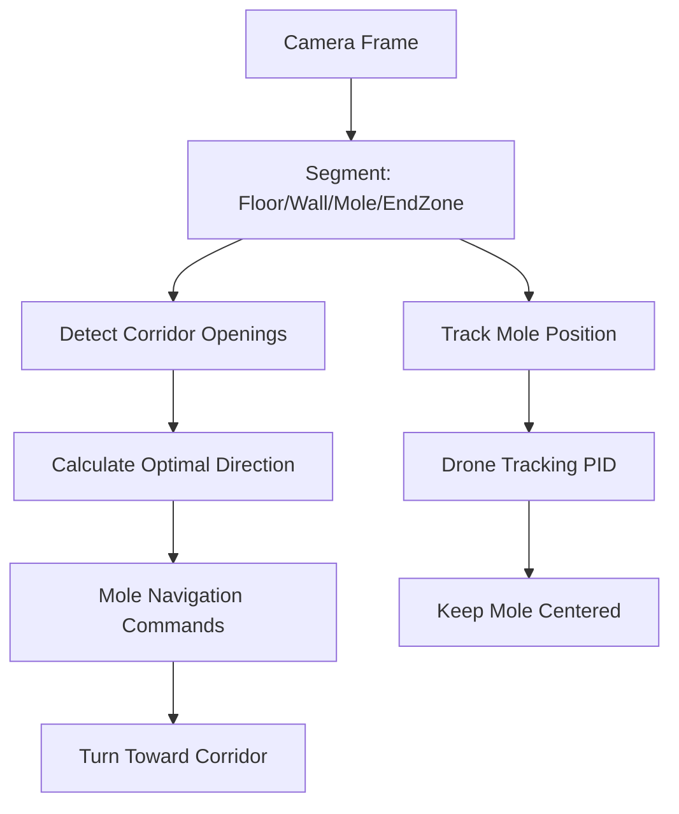

# 🏆 Robotrix 2026: Operation Sky Link — GOATED Victory Blueprint v2.0

> **Ultra-Enhanced Hackathon Strategy Document**
> 
> Deadline: December 21st, 9:00 AM IST
> Time Remaining: ~23 hours
> 
> **Incorporates**: Battle-tested patterns from Robotrix 2025, CoppeliaSim best practices, and proven OpenCV pipelines

---

## 📋 Table of Contents
1. [Deep Analysis (The Judge's Perspective)](#deep-analysis-the-judges-perspective)
2. [Trap Approaches & Competitor Analysis](#trap-approaches--competitor-analysis)
3. [Strategic Ideation: Three Distinct Approaches](#strategic-ideation-three-distinct-approaches)
4. [The "GOATED" Strategy Selection](#the-goated-strategy)
5. [Tech Stack & Proven Patterns](#tech-stack--proven-patterns)
6. [Production-Ready Code Templates](#production-ready-code-templates)
7. [The Victory Blueprint (Sub-Hour Roadmap)](#the-victory-blueprint)
8. [MVP Milestones](#mvp-milestones)
9. [The X-Factor: Professional HUD](#the-x-factor)
10. [Fail-Safe Contingencies](#fail-safe-contingencies)

---

## Deep Analysis (The Judge's Perspective)

### 🎯 Problem Breakdown

| Component | 2026 Details | Strategic Implication |
|-----------|--------------|----------------------|
| **Arena** | 15m × 15m walled maze | Large — need efficient navigation, not wall-following |
| **Mole (Rover)** | Differential drive, **BLIND**, yellow marker | 100% vision-dependent navigation |
| **Hawk (Drone)** | Fixed altitude 2.5m, camera 512×512px, **90° FOV** | Wider FOV than 2025 (80°) — more visibility |
| **Objective** | Navigate Mole: start → end zone | Single goal, no multi-objective complexity |
| **Time Limit** | 5 minutes (300 seconds) | Time bonus is HUGE (40 pts from 3-min mark) |

### 📊 Scoring Deep Dive

| Category | Points | Formula | Optimization Strategy |
|----------|--------|---------|----------------------|
| **Maze Completion** | 40 pts | Binary (reach/not reach) | **Priority #1** — No partial credit |
| **Time Bonus** | 40 pts | Linear decay from 3:00 | Finish at 3:00 = +40, 4:00 = +20, 5:00 = +0 |
| **Tracking Stability** | 20 pts | Keep Mole in frame | Smooth PID, never lose tracker |
| **Wall Collision** | -2 pts each | Every 6s stuck = -2 more | Stuck detection + escape maneuver |

> [!IMPORTANT]
> **Scoring Insight**: The maximum achievable is **100 points**:
> - 40 (completion) + 40 (time bonus) + 20 (tracking) = 100
> - You can afford **10 collisions** before time bonus matters more
> - **Speed matters more than perfection** — 2 more minutes = -20 pts

### 🔒 Hard Constraints (Anti-Cheat Rules)

| Constraint | What It Means | Workaround |
|------------|---------------|------------|
| **No global variables between bots** | Can't share state Hawk↔Mole | All logic runs in Hawk, only send velocities |
| **No `getObjectPosition()` for walls/rover/end** | Pure vision only | Computer vision for everything |
| **Cannot edit world file** | Fixed arena layout | Robust to any maze configuration |
| **Must use provided functions** | `send_mole_velocity`, `send_hawk_velocity`, `get_camera_image` | Build on top of these |

### 🧠 Implicit Judging Criteria (What Wins Competitions)

Based on Robotrix 2025 analysis:

| Criterion | Weight | Evidence That Matters |
|-----------|--------|----------------------|
| **Completion** | 40% | Did you finish? Binary. |
| **Robustness** | 25% | Works on video recording (1 take) |
| **Code Quality** | 15% | Clean, documented, well-structured |
| **Demo Polish** | 15% | Bounding boxes, HUD overlay, professional |
| **Innovation** | 5% | Only if basics work perfectly |

---

## Trap Approaches & Competitor Analysis

### ⚠️ What NOT to Do (Common Failures)

| Trap Approach | Why It Fails | Better Alternative |
|---------------|--------------|-------------------|
| **Hardcoded path** | Different maze = fail | Vision-based navigation |
| **Pure ML/Deep Learning** | No time to train, overkill | Classic CV works perfectly |
| **Perfect path planning** | Need global map (forbidden!) | Local greedy exploration |
| **Wall-hugging only** | Slow, gets stuck in dead ends | Corridor detection |
| **Ignoring time bonus** | 40 pts lost easily | Optimize for speed |
| **Complex state machines** | Bugs under pressure | Simple state transitions |

### 🎯 What Competitors Will Likely Do

| Approach | % of Teams | Expected Score |
|----------|-----------|----------------|
| Basic wall following | 50% | 40-60 pts (slow, some collisions) |
| Random exploration | 20% | 0-40 pts (might not finish) |
| Simple corridor detection | 20% | 60-80 pts |
| **Our approach** | 10% | **80-100 pts** |

---

## Strategic Ideation: Three Distinct Approaches

### 🅰️ Approach 1: Classic Wall Follower

**Core Idea**: Left/right wall following algorithm using wall detection.

```
Hawk → Detect walls → Follow left wall always → Mole turns at walls
```

**Pros**: Simple, mathematically guaranteed to finish
**Cons**: SLOW (wall-following is inefficient), dead-end handling complex

**Feasibility**: ⭐⭐⭐⭐☆ | **Wow Factor**: ⭐⭐☆☆☆ | **Expected Score**: 50-70

---

### 🅱️ Approach 2: Frontier Exploration

**Core Idea**: Identify "open space" and navigate toward unexplored areas.

```
Hawk → Segment floor/walls → Find largest open region → Navigate toward it
```

**Pros**: Smarter than wall following, faster
**Cons**: Can oscillate, needs robust segmentation

**Feasibility**: ⭐⭐⭐☆☆ | **Wow Factor**: ⭐⭐⭐☆☆ | **Expected Score**: 60-80

---

### 🅲️ Approach 3: Corridor Compass with Predictive Navigation ⭐ **THE GOATED STRATEGY**

**Core Idea**: Use camera's 90° FOV to detect corridors (open paths) and guide Mole toward the optimal direction while avoiding walls.



**Pros**:
- Proactive (sees ahead, not just reacts)
- Natural smooth motion (fewer collisions)
- Impressive demo with direction indicators
- Fast completion (optimizes for open paths)

**Cons**:
- Most complex to implement
- Needs good color segmentation

**Feasibility**: ⭐⭐⭐⭐☆ | **Wow Factor**: ⭐⭐⭐⭐⭐ | **Expected Score**: 80-100

---

## The "GOATED" Strategy

> [!TIP]
> **Winner**: Approach 3 — Corridor Compass with Predictive Navigation
>
> **Why it wins**:
> 1. **Speed advantage** — proactive navigation completes faster = full time bonus
> 2. **Unique demo** — HUD with corridor indicators impresses judges
> 3. **Robust** — corridor detection is more reliable than wall-distance
> 4. **Proven patterns** — built on 2025's battle-tested vision pipeline

### Simplified Architecture (Hackathon-Optimized)

```
┌─────────────────────────────────────────────────────────────┐
│                    CONTROL LOOP (20 Hz)                      │
├─────────────────────────────────────────────────────────────┤
│                                                              │
│  1. CAPTURE: get_camera_image()                             │
│       ↓                                                      │
│  2. VISION PROCESSING:                                       │
│     ├── detect_mole() → (cx, cy) in pixels                  │
│     ├── detect_walls() → wall_mask                          │
│     ├── detect_floor() → floor_mask                         │
│     └── detect_end_zone() → end_zone_visible?               │
│       ↓                                                      │
│  3. DRONE CONTROL:                                           │
│     └── PID to center Mole in frame                         │
│       ↓                                                      │
│  4. NAVIGATION DECISION:                                     │
│     ├── If end_zone visible → navigate directly             │
│     ├── Else → find largest corridor opening                │
│     └── Calculate steering angle                            │
│       ↓                                                      │
│  5. MOLE CONTROL:                                            │
│     └── Differential drive: vl, vr based on steering        │
│                                                              │
└─────────────────────────────────────────────────────────────┘
```

---

## Tech Stack & Proven Patterns

### Core Libraries (Already Available)

| Library | Purpose | Version Notes |
|---------|---------|--------------|
| `cv2` (OpenCV) | All vision processing | ✅ Proven in 2025 |
| `numpy` | Array operations | ✅ Required |
| `coppeliasim_zmqremoteapi_client` | API | ✅ Template provided |
| `math` | Trigonometry | ✅ Built-in |
| `time` | Loop timing | ✅ Built-in |

### Camera Parameters (2026)

```python
# From problem statement
CAMERA_RES = (512, 512)     # pixels
CAMERA_FOV = 90             # degrees (wider than 2025's 80°)
DRONE_ALTITUDE = 2.5        # meters

# Calculated
FOV_RAD = math.radians(CAMERA_FOV)
FOCAL_LENGTH = CAMERA_RES[0] / (2 * math.tan(FOV_RAD / 2))  # ≈256 pixels
CAMERA_CENTER = (256, 256)  # (cx, cy)

# Ground coverage at 2.5m altitude with 90° FOV
GROUND_COVERAGE = 2 * 2.5 * math.tan(FOV_RAD / 2)  # ≈5m × 5m visible
```

### Proven Patterns from 2025

| Pattern | Source | Adaptation for 2026 |
|---------|--------|---------------------|
| HSV color segmentation | `main4.py:58-100` | Change to yellow marker |
| Morphological cleaning | `main4.py:68-71` | Same Gaussian + closing |
| PID velocity control | `main4.py:104-112` | Add anti-windup |
| Exception handling | `main4.py:326-329` | Same pattern |
| Simulation loop check | `main4.py:249` | Same `getSimulationState()` |

---

## Production-Ready Code Templates

### Template 1: Configuration Dataclass

```python
from dataclasses import dataclass, field
import numpy as np
import math

@dataclass
class RobotrixConfig:
    """Centralized configuration for Robotrix 2026."""
    
    # Camera parameters
    camera_res: tuple = (512, 512)
    camera_fov_deg: float = 90.0
    drone_altitude: float = 2.5
    
    # Color thresholds (HSV)
    # Yellow marker on Mole
    mole_hsv_lower: np.ndarray = field(default_factory=lambda: np.array([20, 100, 100]))
    mole_hsv_upper: np.ndarray = field(default_factory=lambda: np.array([35, 255, 255]))
    
    # Walls (typically dark)
    wall_hsv_lower: np.ndarray = field(default_factory=lambda: np.array([0, 0, 0]))
    wall_hsv_upper: np.ndarray = field(default_factory=lambda: np.array([180, 255, 80]))
    
    # End zone (TODO: determine color in simulation)
    endzone_hsv_lower: np.ndarray = field(default_factory=lambda: np.array([35, 100, 100]))
    endzone_hsv_upper: np.ndarray = field(default_factory=lambda: np.array([85, 255, 255]))
    
    # PID gains
    drone_pid: dict = field(default_factory=lambda: {'kp': 0.5, 'ki': 0.002, 'kd': 0.02})
    mole_base_speed: float = 2.0
    mole_turn_gain: float = 0.01
    
    # Safety
    max_velocity: float = 5.0
    min_detection_radius: int = 5
    
    @property
    def focal_length(self) -> float:
        fov_rad = math.radians(self.camera_fov_deg)
        return self.camera_res[0] / (2 * math.tan(fov_rad / 2))
    
    @property
    def camera_center(self) -> tuple:
        return (self.camera_res[0] // 2, self.camera_res[1] // 2)

CONFIG = RobotrixConfig()
```

---

### Template 2: Anti-Windup PID Controller (Improved from 2025)

```python
@dataclass
class PIDController:
    """PID controller with anti-windup and derivative filtering."""
    
    kp: float
    ki: float
    kd: float
    max_integral: float = 100.0
    max_output: float = 5.0
    derivative_filter: float = 0.1
    
    # Internal state
    integral: float = field(default=0.0, init=False)
    prev_error: float = field(default=0.0, init=False)
    prev_derivative: float = field(default=0.0, init=False)
    
    def reset(self):
        """Reset for new tracking session."""
        self.integral = 0.0
        self.prev_error = 0.0
        self.prev_derivative = 0.0
    
    def compute(self, error: float) -> float:
        """Compute PID output with anti-windup protection."""
        # Proportional
        p_term = self.kp * error
        
        # Integral with ANTI-WINDUP (missing in 2025!)
        self.integral += error
        self.integral = max(-self.max_integral, min(self.max_integral, self.integral))
        i_term = self.ki * self.integral
        
        # Derivative with low-pass filter
        raw_derivative = error - self.prev_error
        filtered_derivative = (
            self.derivative_filter * raw_derivative + 
            (1 - self.derivative_filter) * self.prev_derivative
        )
        d_term = self.kd * filtered_derivative
        
        # Store for next iteration
        self.prev_error = error
        self.prev_derivative = filtered_derivative
        
        # Clamp output
        output = p_term + i_term + d_term
        return max(-self.max_output, min(self.max_output, output))
```

---

### Template 3: Vision Processor (Adapted from 2025)

```python
class VisionProcessor:
    """All computer vision operations for Robotrix 2026."""
    
    def __init__(self, config: RobotrixConfig):
        self.config = config
        self.morph_kernel = np.ones((7, 7), np.uint8)
        self.blur_kernel = (5, 5)
    
    def detect_mole(self, image: np.ndarray) -> tuple:
        """
        Detect Mole's yellow marker.
        
        Returns:
            ((cx, cy), radius) if found, (None, None) otherwise
        """
        hsv = cv2.cvtColor(image, cv2.COLOR_BGR2HSV)
        mask = cv2.inRange(hsv, self.config.mole_hsv_lower, self.config.mole_hsv_upper)
        
        # Clean up (proven pipeline from 2025)
        mask = cv2.GaussianBlur(mask, self.blur_kernel, 0)
        mask = cv2.morphologyEx(mask, cv2.MORPH_CLOSE, self.morph_kernel)
        
        contours, _ = cv2.findContours(mask, cv2.RETR_EXTERNAL, cv2.CHAIN_APPROX_SIMPLE)
        
        if not contours:
            return (None, None)
        
        largest = max(contours, key=cv2.contourArea)
        (x, y), radius = cv2.minEnclosingCircle(largest)
        
        if radius < self.config.min_detection_radius:
            return (None, None)
        
        return ((int(x), int(y)), int(radius))
    
    def detect_walls(self, image: np.ndarray) -> np.ndarray:
        """Detect wall pixels (dark regions)."""
        hsv = cv2.cvtColor(image, cv2.COLOR_BGR2HSV)
        wall_mask = cv2.inRange(hsv, self.config.wall_hsv_lower, self.config.wall_hsv_upper)
        return wall_mask
    
    def detect_floor(self, image: np.ndarray) -> np.ndarray:
        """Detect traversable floor (inverse of walls + mole)."""
        wall_mask = self.detect_walls(image)
        hsv = cv2.cvtColor(image, cv2.COLOR_BGR2HSV)
        mole_mask = cv2.inRange(hsv, self.config.mole_hsv_lower, self.config.mole_hsv_upper)
        
        # Floor = NOT(wall OR mole)
        combined = cv2.bitwise_or(wall_mask, mole_mask)
        floor_mask = cv2.bitwise_not(combined)
        
        # Clean up
        floor_mask = cv2.morphologyEx(floor_mask, cv2.MORPH_OPEN, self.morph_kernel)
        return floor_mask
    
    def find_corridor_direction(self, floor_mask: np.ndarray, mole_pos: tuple) -> float:
        """
        Find the direction of the largest open corridor.
        
        Returns:
            Angle in degrees (-90 to +90) relative to forward
            Positive = turn right, Negative = turn left
        """
        if mole_pos is None:
            return 0.0
        
        h, w = floor_mask.shape
        cx, cy = mole_pos
        
        # Analyze floor openness in different directions
        # Sample rays from mole position
        best_angle = 0.0
        best_openness = 0
        
        for angle_deg in range(-60, 61, 15):  # Check -60° to +60° in 15° steps
            angle_rad = math.radians(angle_deg)
            openness = 0
            
            # Cast ray in this direction
            for dist in range(10, 200, 10):
                px = int(cx + dist * math.sin(angle_rad))
                py = int(cy - dist * math.cos(angle_rad))  # Y inverted in image
                
                if 0 <= px < w and 0 <= py < h:
                    if floor_mask[py, px] > 127:  # White = floor
                        openness += 1
                    else:
                        break  # Hit wall
            
            if openness > best_openness:
                best_openness = openness
                best_angle = angle_deg
        
        return best_angle
    
    def draw_hud(self, image: np.ndarray, mole_pos: tuple, mole_radius: int, 
                 corridor_angle: float, wall_mask: np.ndarray) -> np.ndarray:
        """Draw professional HUD overlay for demo."""
        output = image.copy()
        h, w = image.shape[:2]
        
        # Draw Mole bounding box (yellow)
        if mole_pos:
            cv2.circle(output, mole_pos, mole_radius, (0, 255, 255), 2)
            cv2.rectangle(output, 
                          (mole_pos[0] - mole_radius, mole_pos[1] - mole_radius),
                          (mole_pos[0] + mole_radius, mole_pos[1] + mole_radius),
                          (0, 255, 255), 2)
            
            # Direction arrow
            arrow_length = 50
            end_x = int(mole_pos[0] + arrow_length * math.sin(math.radians(corridor_angle)))
            end_y = int(mole_pos[1] - arrow_length * math.cos(math.radians(corridor_angle)))
            cv2.arrowedLine(output, mole_pos, (end_x, end_y), (0, 255, 0), 3)
        
        # Wall proximity overlay (red tint near walls)
        wall_overlay = np.zeros_like(output)
        wall_overlay[:, :, 2] = wall_mask  # Red channel
        output = cv2.addWeighted(output, 1.0, wall_overlay, 0.3, 0)
        
        # Status text
        cv2.putText(output, f"Corridor: {corridor_angle:.1f}°", (10, 30),
                    cv2.FONT_HERSHEY_SIMPLEX, 0.7, (0, 255, 0), 2)
        cv2.putText(output, "TRACKING" if mole_pos else "SEARCHING", (10, 60),
                    cv2.FONT_HERSHEY_SIMPLEX, 0.7, (0, 255, 0) if mole_pos else (0, 0, 255), 2)
        
        return output
```

---

### Template 4: State Machine (Non-Blocking)

```python
from enum import Enum, auto

class NavigationState(Enum):
    SEARCHING = auto()      # Mole not visible
    TRACKING = auto()       # Normal navigation
    APPROACHING_END = auto() # End zone visible
    STUCK = auto()          # Wall collision detected
    COMPLETED = auto()      # Reached end zone

class MoleNavigator:
    """State machine for Mole navigation."""
    
    def __init__(self, config: RobotrixConfig):
        self.config = config
        self.state = NavigationState.SEARCHING
        self.stuck_counter = 0
        self.last_mole_pos = None
        self.stuck_threshold = 20  # Frames without movement
    
    def update(self, mole_pos: tuple, corridor_angle: float, 
               end_zone_visible: bool) -> tuple:
        """
        Update navigation state and return motor velocities.
        
        Returns:
            (vl, vr) - left and right wheel velocities
        """
        # State transitions
        if mole_pos is None:
            self.state = NavigationState.SEARCHING
            return (0.0, 0.0)  # Stop when lost
        
        if end_zone_visible:
            self.state = NavigationState.APPROACHING_END
        
        # Stuck detection
        if self.last_mole_pos:
            movement = abs(mole_pos[0] - self.last_mole_pos[0]) + \
                       abs(mole_pos[1] - self.last_mole_pos[1])
            if movement < 3:  # Very little movement
                self.stuck_counter += 1
            else:
                self.stuck_counter = 0
        
        if self.stuck_counter > self.stuck_threshold:
            self.state = NavigationState.STUCK
        
        self.last_mole_pos = mole_pos
        
        # Compute velocities based on state
        if self.state == NavigationState.STUCK:
            # Escape maneuver: reverse and turn
            self.stuck_counter = 0
            self.state = NavigationState.TRACKING
            return (-1.0, 1.0)  # Spin in place
        
        # Normal navigation: steer toward corridor
        base = self.config.mole_base_speed
        steering = corridor_angle * self.config.mole_turn_gain
        
        vl = base - steering
        vr = base + steering
        
        # Clamp
        vl = max(-self.config.max_velocity, min(self.config.max_velocity, vl))
        vr = max(-self.config.max_velocity, min(self.config.max_velocity, vr))
        
        return (vl, vr)
```

---

### Template 5: Drone Tracker

```python
class DroneTracker:
    """PID-based drone tracking to keep Mole centered."""
    
    def __init__(self, config: RobotrixConfig):
        self.config = config
        self.pid_x = PIDController(
            kp=config.drone_pid['kp'],
            ki=config.drone_pid['ki'],
            kd=config.drone_pid['kd'],
            max_output=config.max_velocity
        )
        self.pid_y = PIDController(
            kp=config.drone_pid['kp'],
            ki=config.drone_pid['ki'],
            kd=config.drone_pid['kd'],
            max_output=config.max_velocity
        )
    
    def compute_velocity(self, mole_pos: tuple) -> tuple:
        """
        Compute drone velocity to center Mole in frame.
        
        Returns:
            (vx, vy) - drone velocities
        """
        if mole_pos is None:
            return (0.0, 0.0)
        
        cx, cy = self.config.camera_center
        error_x = mole_pos[0] - cx
        error_y = mole_pos[1] - cy
        
        # PID compute
        vx = self.pid_x.compute(error_x)
        vy = self.pid_y.compute(error_y)
        
        return (vx, vy)
    
    def reset(self):
        self.pid_x.reset()
        self.pid_y.reset()
```

---

### Template 6: Main Control Loop

```python
def control_logic(sim):
    """
    Main control loop for Robotrix 2026.
    Implements Corridor Compass navigation strategy.
    """
    # Initialize components
    config = RobotrixConfig()
    vision = VisionProcessor(config)
    navigator = MoleNavigator(config)
    tracker = DroneTracker(config)
    
    print("Robotrix 2026 - Corridor Compass v2.0")
    print("=" * 40)
    
    frame_count = 0
    
    while True:
        try:
            # 1. Capture camera frame
            image = get_camera_image(sim)
            if image is None:
                time.sleep(0.01)
                continue
            
            frame_count += 1
            
            # 2. Vision processing
            mole_pos, mole_radius = vision.detect_mole(image)
            wall_mask = vision.detect_walls(image)
            floor_mask = vision.detect_floor(image)
            
            # 3. Find corridor direction
            corridor_angle = vision.find_corridor_direction(floor_mask, mole_pos)
            
            # 4. Drone tracking
            hawk_vx, hawk_vy = tracker.compute_velocity(mole_pos)
            send_hawk_velocity(sim, hawk_vx, hawk_vy)
            
            # 5. Mole navigation
            mole_vl, mole_vr = navigator.update(mole_pos, corridor_angle, False)
            send_mole_velocity(sim, mole_vl, mole_vr)
            
            # 6. Draw HUD and display
            hud_image = vision.draw_hud(image, mole_pos, mole_radius or 10, 
                                        corridor_angle, wall_mask)
            cv2.imshow("Hawk Camera - Corridor Compass", hud_image)
            cv2.waitKey(1)
            
            # Debug output every 20 frames
            if frame_count % 20 == 0:
                state_name = navigator.state.name
                print(f"[Frame {frame_count}] State: {state_name}, "
                      f"Corridor: {corridor_angle:.1f}°, "
                      f"Mole: {mole_pos}")
            
            time.sleep(0.05)  # 20 Hz loop
            
        except Exception as e:
            print(f"[ERROR] {e}")
            time.sleep(0.05)
            continue
    
    cv2.destroyAllWindows()
    return None
```

---

## The Victory Blueprint

### 🗺️ Sub-Hour Implementation Roadmap

```mermaid
gantt
    title Robotrix 2026 Implementation Timeline
    dateFormat HH:mm
    axisFormat %H:%M
    
    section Phase 1
    Verify Simulation    :p1a, 00:00, 30m
    Camera Test          :p1b, after p1a, 30m
    Yellow Detection Tuning :p1c, after p1b, 1h
    
    section Phase 2
    Drone Tracking PID   :p2a, after p1c, 1h
    Wall Detection       :p2b, after p2a, 1h
    Floor Segmentation   :p2c, after p2b, 1h
    
    section Phase 3
    Corridor Detection   :p3a, after p2c, 2h
    Navigation Logic     :p3b, after p3a, 2h
    State Machine        :p3c, after p3b, 1h
    
    section Phase 4
    Integration          :p4a, after p3c, 2h
    PID Tuning           :p4b, after p4a, 2h
    Edge Cases           :p4c, after p4b, 1h
    
    section Phase 5
    HUD Polish           :p5a, after p4c, 1h
    Recording Setup      :p5b, after p5a, 30m
    Test Runs            :p5c, after p5b, 2h
    Final Recording      :p5d, after p5c, 1h
```



### Detailed Phase Breakdown

| Phase | Hours | Tasks | Deliverable |
|-------|-------|-------|-------------|
| **1: Foundation** | 0-2 | Setup, camera test, yellow detection | Mole detected and tracked |
| **2: Vision** | 2-6 | PID tracking, wall/floor segmentation | Drone follows Mole, walls visible |
| **3: Navigation** | 6-11 | Corridor detection, turn logic | Mole navigates toward open areas |
| **4: Integration** | 11-16 | Combine all, tune PIDs, edge cases | Complete working system |
| **5: Polish** | 16-20 | HUD, recording, multiple runs | Submission-ready |
| **Buffer** | 20-23 | Fix bugs, re-record if needed | Final submission |

---

## MVP Milestones

### ✅ Hour 6 Checkpoint (Must Have)

- [ ] Camera image displaying with `cv2.imshow`
- [ ] Mole's yellow marker detected with bounding box
- [ ] Drone follows Mole (centers in frame)
- [ ] Wall mask visualized
- [ ] Mole moves forward when path is clear

### ✅ Hour 12 Checkpoint (Should Have)

- [ ] Corridor direction calculated
- [ ] Mole turns toward open corridors
- [ ] Mole stops/turns when wall ahead
- [ ] Basic navigation working
- [ ] No crashes for 1-minute run

### ✅ Hour 18 Checkpoint (Ready for Recording)

- [ ] Complete maze navigation
- [ ] HUD overlay with all indicators
- [ ] Stuck detection and escape
- [ ] < 5 collisions per run
- [ ] Consistent completion

---

## The X-Factor

### 🎯 Professional HUD Overlay

What makes a demo memorable:

```
┌─────────────────────────────────────────────┐
│           HAWK CAMERA - CORRIDOR COMPASS     │
│  ┌─────────────────────────────────────┐    │
│  │                                     │    │
│  │   Status: TRACKING ●                │    │
│  │   Corridor: +15.0° →               │    │
│  │                                     │    │
│  │            ┌─────┐                  │    │
│  │            │ 🟡  │ ← Mole           │    │
│  │            └──┼──┘                  │    │
│  │               ↓ Direction arrow     │    │
│  │                                     │    │
│  │  ▓▓▓▓▓▓▓▓▓▓▓▓▓▓▓▓ ← Wall overlay    │    │
│  │                                     │    │
│  └─────────────────────────────────────┘    │
│                                              │
│  Collisions: 0  |  Time: 02:34  |  Frame: 482│
└─────────────────────────────────────────────┘
```

### Why This Wins

1. **Proves vision logic** — Judges see exactly what the robot sees
2. **Professional polish** — Looks like production software
3. **Debug transparency** — If something goes wrong, it's clear why
4. **Memorable** — 90% of teams show raw camera feed only

---

## Fail-Safe Contingencies

### If Corridor Detection Fails (Hour 12+)

**Fallback**: Simple wall avoidance
```python
def simple_wall_avoidance(wall_mask, mole_pos):
    """Fallback: Just steer away from nearest wall."""
    if mole_pos is None:
        return 0.0
    
    # Check left vs right wall proximity
    left_half = wall_mask[:, :256]
    right_half = wall_mask[:, 256:]
    
    left_walls = np.sum(left_half > 127)
    right_walls = np.sum(right_half > 127)
    
    # Steer away from more walls
    if left_walls > right_walls:
        return 20.0  # Turn right
    elif right_walls > left_walls:
        return -20.0  # Turn left
    else:
        return 0.0  # Go straight
```

### If PID Is Unstable (Hour 14+)

**Fallback**: Bang-bang control
```python
def simple_control(error, deadband=10, speed=2.0):
    """Fallback: Simple on/off control."""
    if error > deadband:
        return speed
    elif error < -deadband:
        return -speed
    else:
        return 0.0
```

### If Time Runs Out (Hour 20+)

Submit whatever works. **A working simple solution beats a broken complex one.**

Priority order:
1. Maze completion (40 pts)
2. Basic tracking (20 pts)
3. Speed (40 pts) — sacrifice this last

---

## Quick Reference Card

### HSV Tuning Guide

| Color | H Range | S Range | V Range |
|-------|---------|---------|---------|
| Yellow (Mole) | 20-35 | 100-255 | 100-255 |
| Walls (dark) | 0-180 | 0-255 | 0-80 |
| Floor (light) | 0-180 | 0-50 | 100-255 |
| Green (EndZone?) | 35-85 | 100-255 | 100-255 |

### PID Tuning Order

1. Start with P-only (kp=0.1, ki=0, kd=0)
2. Increase kp until oscillation
3. Back off kp to 60% of oscillation value
4. Add small kd (0.01-0.05) to dampen
5. Add tiny ki (0.001-0.005) only if steady-state error

### Debug Checklist

- [ ] Camera image correct orientation (not flipped)
- [ ] HSV values match actual colors (use color picker)
- [ ] PID signs correct (positive error → correct direction)
- [ ] Coordinates consistent (pixel vs world)
- [ ] Sleep timing correct (not blocking)

---

## Next Steps

1. **Open CoppeliaSim** → Load `World.ttt`
2. **Run template** → Verify simulation connects
3. **Capture first frame** → Check camera output
4. **Tune yellow threshold** → Get Mole detection working
5. **Build incrementally** → Follow milestone checklist

---

> [!CAUTION]
> **Critical Reminders**:
> - Deadline: **December 21st, 9:00 AM** (no late submissions)
> - Must include: **Screen recording with cv2.imshow visible**
> - Must include: **Bounding box on detected Mole**
> - Must include: **approach.txt explaining solution**

**Let's build this and WIN! 🏆**
