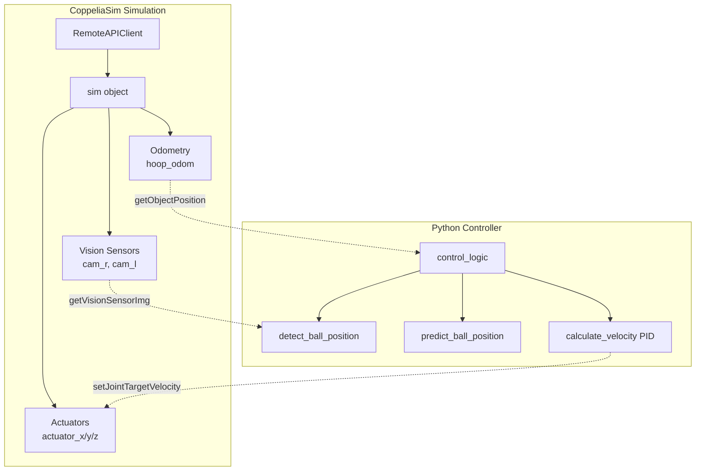

# 🏀 Robotrix 2026 Competitive Knowledge Base

> **Strategic Foundation Document** — Forensic Analysis of Robotrix 2025 Codebase
> 
> *Prepared for AI-assisted code generation and competition strategy*

---

## 📋 Table of Contents

1. [Executive Summary](#executive-summary)
2. [Phase 1: Architecture & Tech Stack Audit](#phase-1-architecture--tech-stack-audit)
3. [Phase 2: Feature & Logic Extraction](#phase-2-feature--logic-extraction)
4. [Phase 3: Critical Gap Analysis](#phase-3-critical-gap-analysis)
5. [Phase 4: Reusable Code Templates](#phase-4-reusable-code-templates)
6. [Logic Maps & Decision Trees](#logic-maps--decision-trees)
7. [Strategy Notes](#strategy-notes)
8. [Prompting Primers for 2026](#prompting-primers-for-2026)

---

## Executive Summary

### 2025 Problem Statement: "Basket the Ball"

**Objective**: Control a movable basketball hoop using stereo vision to intercept and catch basketballs shot by an automated shooter. The hoop can move along X, Y, and Z axes via sliding joints.

**Key Constraints**:
- `getObjectPosition()` restricted to `hoop_odom` only (ball position must be computed)
- 10 shots per run, 10 points per catch, max 100 points
- Arena: 10m × 10m, Hoop diameter: 320mm
- Stereo cameras: 512×512px, 80° FOV, 700mm baseline

**Team Approach**: Stereo vision + color-based ball detection + projectile trajectory prediction + PID-controlled hoop movement

---

## Phase 1: Architecture & Tech Stack Audit

### 🔧 Tech Stack

| Category | Technology | Version/Details |
|----------|------------|-----------------|
| **Language** | Python | 3.x |
| **Simulation** | CoppeliaSim | Via ZeroMQ Remote API |
| **Computer Vision** | OpenCV (`cv2`) | Core detection engine |
| **Numerical Computing** | NumPy | Array operations, calculations |
| **API Client** | `coppeliasim_zmqremoteapi_client` | `RemoteAPIClient` class |

### 🔌 Core APIs & Hardware Interfaces



#### Simulation API Methods Used

| Method | Purpose | Handle |
|--------|---------|--------|
| `sim.getObject(path)` | Get object handle | Actuators, cameras, odom |
| `sim.getVisionSensorImg(handle)` | Capture camera image | `cam_r`, `cam_l` |
| `sim.unpackUInt8Table(data)` | Decode image bytes | Raw image data |
| `sim.setJointTargetVelocity(handle, vel)` | Control joint speed | Actuators |
| `sim.getObjectPosition(handle, ref)` | Get 3D position | `hoop_odom` |
| `sim.getSimulationState()` | Check sim status | Loop control |

### 📁 Project Structure & Code Evolution

```
robotrix-2k25/
├── code/
│   ├── task.py          # Template (empty control_logic)
│   ├── main,py          # Iteration 1: Basic stereo + PID
│   ├── main2.py         # Iteration 2: Add trajectory prediction
│   ├── main3.py         # Iteration 3: Correct focal length calc
│   └── main4.py         # Iteration 4: Final with reset logic
├── world/
│   └── court.ttt        # CoppeliaSim world file
├── README.md            # Problem statement + approach docs
└── debug_img_*.jpg      # Debug camera captures
```

#### Code Evolution Timeline

| Version | Key Changes | PID Gains (kp, ki, kd) |
|---------|-------------|------------------------|
| `main,py` | Basic reactive control, no prediction | 0.1, 0.005, 0.05 |
| `main2.py` | Added `predict_ball_position()`, ball reset detection | 0.05, 0.002, 0.02 |
| `main3.py` | Corrected stereo depth formula, proper coordinate conversion | 0.5, 0.002, 0.02 |
| `main4.py` | Added proper exception handling, improved reset logic | 0.5, 0.002, 0.02 |

---

## Phase 2: Feature & Logic Extraction

### 🎯 High-Utility Functions

#### 1. **Ball Detection Pipeline** (Most Critical)

```python
# Frequency: Called every frame (~20Hz)
# Purpose: Convert raw camera image to 2D ball center coordinates

def detect_ball_position_single(image):
    """
    HSV color segmentation → Gaussian blur → Morphological closing 
    → Contour detection → Min enclosing circle
    """
```

**Call Chain**: `control_logic()` → `detect_ball_position()` → `detect_ball_position_single()` × 2

#### 2. **Stereo Depth Calculation**

```python
# Frequency: Called every frame when ball visible in both cameras
# Core Formula: Z = (focal_length × baseline) / disparity

def detect_ball_position(img_r, img_l):
    """
    Triangulate 3D position from stereo camera pair
    """
```

#### 3. **PID Velocity Control**

```python
# Frequency: Called 3× per frame (X, Y, Z axes)
# Purpose: Smooth motion control with error minimization

def calculate_velocity(error, pid):
    """
    Standard PID: output = Kp*e + Ki*∫e + Kd*de/dt
    """
```

#### 4. **Trajectory Prediction**

```python
# Frequency: Called every frame when ball detected
# Purpose: Anticipate ball's future position for interception

def predict_ball_position(current_position, timestamp):
    """
    Linear velocity estimation from consecutive frames
    Project position forward by prediction_horizon
    """
```

### 🧠 Core Algorithmic Logic

#### Stereo Vision Depth Estimation

The team correctly identified that `getObjectPosition()` was restricted for the ball, requiring stereo triangulation:

```
Disparity (d) = x_left - x_right  (pixel difference between cameras)
Depth (Z) = (f × B) / d

Where:
  f = focal_length = image_width / (2 × tan(FOV/2))
  B = baseline = 0.7m (camera separation)
  FOV = 80° = 1.396 radians
```

#### Coordinate Transformation

```
X_world = ((x_pixel - cx) × Z) / focal_length
Y_world = ((y_pixel - cy) × Z) / focal_length

Where cx, cy = 256, 256 (image center for 512×512)
```

#### Motion Prediction Model

The team used a **simplified linear velocity model**:

```
velocity = (position_now - position_prev) / delta_time
predicted_pos = current_pos + velocity × prediction_horizon
```

> [!NOTE]
> The team documented a more sophisticated projectile motion model in README.md (with gravity: z(t) = v_z*t + z_0 - 0.5*g*t²) but the implementation uses **linear extrapolation only**.

---

## Phase 3: Critical Gap Analysis

### ⚠️ Identified Weaknesses & Technical Debt

#### 1. **Incomplete Projectile Physics Model** (HIGH IMPACT)

**Problem**: The README documents proper parabolic trajectory prediction with gravity, but implementation uses only linear velocity extrapolation.

```python
# Current (linear):
predicted_position = current + delta_position × horizon / delta_time

# Should be (parabolic):
predicted_z = z_0 + v_z*t - 0.5*g*t²
```

**Impact**: Ball trajectory prediction degrades significantly at peak/descent phases where gravity dominates.

**2026 Fix**: Implement proper Kalman filter with physics-based state transition model.

---

#### 2. **No Integral Windup Protection** (MEDIUM IMPACT)

**Problem**: PID integral term accumulates without bounds.

```python
# Current:
pid['integral'] += error  # Unbounded accumulation!
```

**Impact**: Extended error periods cause sluggish recovery or oscillation.

**2026 Fix**:

```python
MAX_INTEGRAL = 100  # Tune this value
pid['integral'] = max(-MAX_INTEGRAL, min(MAX_INTEGRAL, pid['integral'] + error))
```

---

#### 3. **Focal Length Calculation Inconsistency** (MEDIUM IMPACT)

**Problem**: Different versions used different focal length formulas:

| Version | Focal Length Calculation |
|---------|-------------------------|
| `main,py`/`main2.py` | `512 / 2 = 256` (incorrect) |
| `main3.py`/`main4.py` | `512 / (2 × tan(80°/2))` ≈ 308.5 (correct) |
| `coord-fetch.py` | Same correct formula |

**2026 Fix**: Centralize camera intrinsics in a configuration class.

---

#### 4. **Mixed Coordinate Frame Handling** (MEDIUM IMPACT)

**Problem**: `main2.py` averages pixel coordinates directly:

```python
x = (pos_l[0] + pos_r[0]) / 2  # Still in pixels!
```

Later versions correctly convert to world coordinates but inconsistently.

**2026 Fix**: Create explicit `PixelPoint` and `WorldPoint` types with validated conversions.

---

#### 5. **Blocking Reset Function** (LOW IMPACT)

**Problem**: `reset_hoop_position()` contains a blocking while loop that halts the main control loop.

```python
while (abs(delta_x) > tolerance or ...):
    sim.setJointTargetVelocity(...)
    # <-- Blocks here until complete!
```

**Impact**: Misses ball detections during reset maneuver.

**2026 Fix**: Convert to state machine with non-blocking async control.

---

### 📊 Technical Debt Summary

| Issue | Severity | Effort to Fix | Impact on Score |
|-------|----------|---------------|-----------------|
| Linear vs parabolic prediction | 🔴 High | Medium | -20 to -30 pts |
| No integral windup protection | 🟡 Medium | Low | -5 to -10 pts |
| Focal length inconsistency | 🟡 Medium | Low | -5 pts |
| Coordinate frame confusion | 🟡 Medium | Medium | -5 to -10 pts |
| Blocking reset function | 🟢 Low | Medium | -5 pts |

---

## Phase 4: Reusable Code Templates

### Template 1: Optimized Color-Based Object Detection

```python
import cv2
import numpy as np
from dataclasses import dataclass
from typing import Optional, Tuple

@dataclass
class DetectionConfig:
    """Configurable detection parameters for different colored objects."""
    color_lower: np.ndarray
    color_upper: np.ndarray
    blur_kernel: int = 5
    morph_kernel: int = 7
    min_radius: int = 2
    
# Preset for orange basketball
BASKETBALL_CONFIG = DetectionConfig(
    color_lower=np.array([5, 100, 150]),
    color_upper=np.array([20, 255, 255]),
    min_radius=2
)

def detect_colored_object(
    image: np.ndarray, 
    config: DetectionConfig
) -> Optional[Tuple[Tuple[int, int], int]]:
    """
    Detect a colored circular object in an image.
    
    Returns:
        Tuple of ((center_x, center_y), radius) if found, None otherwise
    """
    # Convert to HSV color space
    hsv = cv2.cvtColor(image, cv2.COLOR_BGR2HSV)
    
    # Create binary mask
    mask = cv2.inRange(hsv, config.color_lower, config.color_upper)
    
    # Noise reduction
    mask = cv2.GaussianBlur(mask, (config.blur_kernel,) * 2, 0)
    
    # Fill holes with morphological closing
    kernel = np.ones((config.morph_kernel,) * 2, np.uint8)
    mask = cv2.morphologyEx(mask, cv2.MORPH_CLOSE, kernel)
    
    # Find contours
    contours, _ = cv2.findContours(mask, cv2.RETR_EXTERNAL, cv2.CHAIN_APPROX_SIMPLE)
    
    if not contours:
        return None
    
    # Get largest contour
    largest = max(contours, key=cv2.contourArea)
    
    # Fit minimum enclosing circle
    (x, y), radius = cv2.minEnclosingCircle(largest)
    
    if radius < config.min_radius:
        return None
    
    return ((int(x), int(y)), int(radius))
```

---

### Template 2: Robust PID Controller with Anti-Windup

```python
from dataclasses import dataclass, field
from typing import Optional

@dataclass
class PIDController:
    """PID controller with anti-windup and derivative filtering."""
    
    kp: float
    ki: float
    kd: float
    max_integral: float = 100.0
    max_output: float = 5.0
    derivative_filter: float = 0.1  # Low-pass filter coefficient
    
    # Internal state
    integral: float = field(default=0.0, init=False)
    prev_error: float = field(default=0.0, init=False)
    prev_derivative: float = field(default=0.0, init=False)
    
    def reset(self):
        """Reset controller state for new tracking session."""
        self.integral = 0.0
        self.prev_error = 0.0
        self.prev_derivative = 0.0
    
    def compute(self, error: float, dt: Optional[float] = None) -> float:
        """
        Compute PID output with anti-windup protection.
        
        Args:
            error: Current error (setpoint - measurement)
            dt: Time step (optional, affects I and D terms)
            
        Returns:
            Control output, clamped to [-max_output, max_output]
        """
        # Proportional term
        p_term = self.kp * error
        
        # Integral term with anti-windup
        self.integral += error
        self.integral = max(-self.max_integral, min(self.max_integral, self.integral))
        i_term = self.ki * self.integral
        
        # Derivative term with low-pass filter
        raw_derivative = error - self.prev_error
        filtered_derivative = (
            self.derivative_filter * raw_derivative + 
            (1 - self.derivative_filter) * self.prev_derivative
        )
        d_term = self.kd * filtered_derivative
        
        # Store for next iteration
        self.prev_error = error
        self.prev_derivative = filtered_derivative
        
        # Compute and clamp output
        output = p_term + i_term + d_term
        return max(-self.max_output, min(self.max_output, output))

# Usage example:
# pid_x = PIDController(kp=0.5, ki=0.002, kd=0.02, max_output=5.0)
# velocity = pid_x.compute(target_x - current_x)
```

---

### Template 3: Stereo Vision Depth Calculator

```python
import math
from dataclasses import dataclass
from typing import Tuple, Optional

@dataclass
class StereoCamera:
    """Stereo camera configuration and depth calculation."""
    
    resolution: Tuple[int, int]  # (width, height) in pixels
    fov_degrees: float           # Horizontal field of view
    baseline_meters: float       # Distance between cameras
    
    @property
    def focal_length(self) -> float:
        """Calculate focal length in pixels from FOV."""
        fov_rad = math.radians(self.fov_degrees)
        return self.resolution[0] / (2 * math.tan(fov_rad / 2))
    
    @property
    def principal_point(self) -> Tuple[float, float]:
        """Return image center (cx, cy)."""
        return (self.resolution[0] / 2, self.resolution[1] / 2)
    
    def pixel_to_world(
        self,
        left_point: Tuple[int, int],
        right_point: Tuple[int, int]
    ) -> Optional[Tuple[float, float, float]]:
        """
        Convert stereo pixel coordinates to world coordinates.
        
        Args:
            left_point: (x, y) pixel coords in left camera
            right_point: (x, y) pixel coords in right camera
            
        Returns:
            (X, Y, Z) world coordinates in meters, or None if invalid
        """
        disparity = abs(left_point[0] - right_point[0])
        
        # Avoid division by zero
        if disparity < 1e-5:
            return None
        
        # Calculate depth
        z = (self.focal_length * self.baseline_meters) / disparity
        
        # Convert to world coordinates (using left camera as reference)
        cx, cy = self.principal_point
        x = ((left_point[0] - cx) * z) / self.focal_length
        y = ((left_point[1] - cy) * z) / self.focal_length
        
        return (x, y, z)

# Usage for Robotrix:
ROBOTRIX_CAMERA = StereoCamera(
    resolution=(512, 512),
    fov_degrees=80.0,
    baseline_meters=0.7
)
```

---

### Template 4: Physics-Based Trajectory Predictor

```python
from dataclasses import dataclass, field
from typing import Tuple, Optional, List
import time

@dataclass
class TrajectoryPoint:
    """3D position with timestamp."""
    x: float
    y: float
    z: float
    t: float  # timestamp

@dataclass
class ProjectilePredictor:
    """
    Predict projectile trajectory using physics model.
    
    Uses linear motion for X/Y and parabolic motion for Z (gravity).
    """
    
    gravity: float = 9.81  # m/s²
    history_size: int = 5  # Number of points to retain for velocity estimation
    
    history: List[TrajectoryPoint] = field(default_factory=list, init=False)
    
    def update(self, position: Tuple[float, float, float], timestamp: Optional[float] = None):
        """Add a new observation to the trajectory history."""
        t = timestamp or time.time()
        self.history.append(TrajectoryPoint(position[0], position[1], position[2], t))
        
        # Keep only recent history
        if len(self.history) > self.history_size:
            self.history = self.history[-self.history_size:]
    
    def get_velocity(self) -> Optional[Tuple[float, float, float]]:
        """Estimate current velocity from recent observations."""
        if len(self.history) < 2:
            return None
        
        # Use most recent two points
        p1, p2 = self.history[-2], self.history[-1]
        dt = p2.t - p1.t
        
        if dt < 1e-6:
            return None
        
        vx = (p2.x - p1.x) / dt
        vy = (p2.y - p1.y) / dt
        vz = (p2.z - p1.z) / dt
        
        return (vx, vy, vz)
    
    def predict(self, time_ahead: float) -> Optional[Tuple[float, float, float]]:
        """
        Predict position at time_ahead seconds from now.
        
        Uses linear extrapolation for X/Y and parabolic for Z.
        """
        if not self.history:
            return None
        
        velocity = self.get_velocity()
        if velocity is None:
            # Return current position if no velocity data
            p = self.history[-1]
            return (p.x, p.y, p.z)
        
        p = self.history[-1]
        vx, vy, vz = velocity
        
        # Linear motion for X and Y
        predicted_x = p.x + vx * time_ahead
        predicted_y = p.y + vy * time_ahead
        
        # Parabolic motion for Z (accounting for gravity)
        predicted_z = p.z + vz * time_ahead - 0.5 * self.gravity * time_ahead**2
        
        return (predicted_x, predicted_y, predicted_z)
    
    def reset(self):
        """Clear trajectory history for new ball throw."""
        self.history.clear()

# Usage:
# predictor = ProjectilePredictor(gravity=9.81)
# predictor.update(ball_position, time.time())
# future_pos = predictor.predict(0.5)  # Where ball will be in 0.5 seconds
```

---

### Template 5: CoppeliaSim Image Handler

```python
import numpy as np
import cv2
from typing import Tuple, Optional

def process_coppelia_image(
    raw_data: bytes,
    sim,
    target_resolution: Tuple[int, int] = (512, 512)
) -> np.ndarray:
    """
    Convert CoppeliaSim vision sensor output to OpenCV-compatible BGR image.
    
    Args:
        raw_data: Raw bytes from sim.getVisionSensorImg()
        sim: CoppeliaSim sim object
        target_resolution: Expected (width, height)
        
    Returns:
        BGR numpy array suitable for OpenCV processing
    """
    # Unpack byte table
    unpacked = sim.unpackUInt8Table(raw_data)
    
    # Reshape to image dimensions
    img = np.array(unpacked, dtype=np.uint8).reshape(
        (target_resolution[1], target_resolution[0], 3)
    )
    
    # CoppeliaSim images are upside-down and RGB
    img = cv2.flip(img, 0)  # Flip vertically
    img = cv2.cvtColor(img, cv2.COLOR_RGB2BGR)  # Convert to BGR for OpenCV
    
    return img


def get_stereo_images(
    sim,
    cam_left_handle: int,
    cam_right_handle: int,
    resolution: Tuple[int, int] = (512, 512)
) -> Optional[Tuple[np.ndarray, np.ndarray]]:
    """
    Capture and process stereo image pair from CoppeliaSim.
    
    Returns:
        Tuple of (left_image, right_image) as BGR arrays, or None if error
    """
    # Capture from both cameras
    img_l_raw, res_l = sim.getVisionSensorImg(cam_left_handle)
    img_r_raw, res_r = sim.getVisionSensorImg(cam_right_handle)
    
    # Validate resolution
    expected_res = list(resolution)
    if res_l != expected_res or res_r != expected_res:
        return None
    
    # Process both images
    img_l = process_coppelia_image(img_l_raw, sim, resolution)
    img_r = process_coppelia_image(img_r_raw, sim, resolution)
    
    return (img_l, img_r)
```

---

## Logic Maps & Decision Trees

### 🌳 Main Control Loop Decision Tree

```
┌─────────────────────────────────────┐
│         START CONTROL LOOP          │
└─────────────────┬───────────────────┘
                  ▼
        ┌─────────────────┐
        │ Capture stereo  │
        │ camera images   │
        └────────┬────────┘
                 ▼
        ┌─────────────────┐
        │ Resolution OK?  │──── NO ───▶ [CONTINUE - skip frame]
        └────────┬────────┘
                 │ YES
                 ▼
        ┌─────────────────┐
        │ Detect ball in  │
        │ both cameras    │
        └────────┬────────┘
                 ▼
        ┌─────────────────┐              ┌─────────────────┐
        │ Ball visible in │              │ Move hoop to    │
        │ BOTH cameras?   │──── NO ───▶  │ reset position  │
        └────────┬────────┘              │ Stop actuators  │
                 │ YES                   └─────────────────┘
                 ▼
        ┌─────────────────┐
        │ Calculate 3D    │
        │ position via    │
        │ stereo depth    │
        └────────┬────────┘
                 ▼
        ┌─────────────────┐
        │ Ball at reset   │──── YES ──▶ [Reset hoop position]
        │ stand position? │
        └────────┬────────┘
                 │ NO
                 ▼
        ┌─────────────────┐
        │ Predict future  │
        │ ball position   │
        │ (trajectory)    │
        └────────┬────────┘
                 ▼
        ┌─────────────────┐
        │ Calculate error │
        │ (predicted ball │
        │ - hoop pos)     │
        └────────┬────────┘
                 ▼
        ┌─────────────────┐
        │ PID controller  │
        │ compute velocity│
        │ for X, Y, Z     │
        └────────┬────────┘
                 ▼
        ┌─────────────────┐
        │ Clamp velocities│
        │ to MAX_VELOCITY │
        └────────┬────────┘
                 ▼
        ┌─────────────────────────────┐
        │ Send velocities to actuators│
        └────────┬────────────────────┘
                 ▼
        ┌─────────────────┐
        │ Sleep 50ms      │
        │ (20 Hz loop)    │
        └────────┬────────┘
                 ▼
        ┌─────────────────┐
        │ Sim still       │
        │ running?        │──── NO ───▶ [EXIT LOOP]
        └────────┬────────┘
                 │ YES
                 └──────────────────────────▶ [LOOP TO START]
```

### 🎯 Ball Detection Pipeline

```
┌───────────────────┐
│   Input Image     │
│   (BGR 512×512)   │
└─────────┬─────────┘
          ▼
┌───────────────────┐
│ cv2.cvtColor      │
│ BGR → HSV         │
└─────────┬─────────┘
          ▼
┌───────────────────┐
│ cv2.inRange       │
│ HSV thresholding  │
│ [5,100,150] to    │
│ [20,255,255]      │
└─────────┬─────────┘
          ▼
┌───────────────────────┐
│ cv2.GaussianBlur      │
│ Kernel: (5, 5)        │
│ Reduce noise          │
└─────────┬─────────────┘
          ▼
┌──────────────────────────┐
│ cv2.morphologyEx         │
│ MORPH_CLOSE, (7,7) kernel│
│ Fill gaps in mask        │
└─────────┬────────────────┘
          ▼
┌───────────────────┐
│ cv2.findContours  │
│ RETR_EXTERNAL     │
└─────────┬─────────┘
          ▼
┌───────────────────┐      ┌───────────────┐
│ Contours found?   │─ NO ─│ Return None   │
└─────────┬─────────┘      └───────────────┘
          │ YES
          ▼
┌─────────────────────────┐
│ max(contours,           │
│     key=cv2.contourArea)│
└─────────┬───────────────┘
          ▼
┌───────────────────────────┐
│ cv2.minEnclosingCircle    │
│ → (center_x, center_y),   │
│   radius                  │
└─────────┬─────────────────┘
          ▼
┌───────────────────┐      ┌───────────────┐
│ radius > min_     │─ NO ─│ Return None   │
│ threshold (2)?    │      │ (noise)       │
└─────────┬─────────┘      └───────────────┘
          │ YES
          ▼
┌───────────────────┐
│ Return (x, y)     │
│ center pixel      │
│ coordinates       │
└───────────────────┘
```

---

## Strategy Notes

### ✅ What Worked in 2025

| Strategy | Evidence | Recommendation for 2026 |
|----------|----------|------------------------|
| **HSV color segmentation** | Robust orange ball detection even with varying depth | Keep as primary detection method |
| **Stereo vision triangulation** | Successfully computed 3D position from 2D cameras | Essential technique, improve calibration |
| **PID velocity control** | Smooth hoop movement without jerky motions | Keep, but add anti-windup |
| **Morphological closing** | Filled gaps in partial ball occlusions | Effective preprocessing step |
| **Minimum enclosing circle** | Works better than bounding box for spherical objects | Good geometric fit |

### 🔄 What to Evolve for 2026

| Area | 2025 Approach | 2026 Improvement |
|------|--------------|------------------|
| **Trajectory prediction** | Linear velocity extrapolation | Kalman filter with gravity model |
| **State management** | Global variables scattered | State machine with explicit states |
| **Configuration** | Hardcoded values throughout | Centralized config dataclass |
| **Error handling** | Basic try-catch with continues | Structured error states with recovery |
| **Coordinate systems** | Implicit conversions | Explicit typed coordinate classes |
| **Hoop reset** | Blocking while-loop | Non-blocking async state |
| **Debugging** | cv2.imshow in production | Configurable debug mode flag |

### 🎯 Competitive Edge Opportunities

1. **Faster Prediction**: Current 1-second prediction horizon may be too long. Test 0.3-0.5s for more accurate short-term tracking.

2. **Multi-ball handling**: If 2026 introduces multiple balls, refactor to track multiple contours.

3. **Ball spin detection**: Use optical flow between frames to detect spin for more accurate trajectory prediction.

4. **Adaptive PID**: Tune PID gains based on distance to ball (more aggressive when far, gentler when close).

5. **Confidence scoring**: Add detection confidence metric to ignore low-quality detections.

---

## Prompting Primers for 2026

Use these prompts to leverage this knowledge base for 2026 code generation:

### Prompt 1: Core Control System

```
You are helping me build a robotics controller for the Robotrix 2026 competition.

CONTEXT:
- I'm controlling a basketball hoop that moves on 3 axes (X, Y, Z) in CoppeliaSim
- I have stereo cameras (512×512, 80° FOV, 700mm baseline)
- I need to catch basketballs shot by an automated shooter
- Ball has orange color (HSV: H:5-20, S:100-255, V:150-255)

LEGACY REFERENCE:
[Paste relevant sections from this knowledge base]

TASK:
Create a modular control system with:
1. A `StereoVision` class for 3D ball position calculation
2. A `TrajectoryPredictor` using Kalman filter with gravity
3. A `PIDController` class with anti-windup
4. A main `HoopController` state machine

Use Python, OpenCV, NumPy, and coppeliasim_zmqremoteapi_client.
Emphasize clean separation of concerns and configuration flexibility.
```

### Prompt 2: Vision Pipeline Optimization

```
I need to optimize a color-based object detection pipeline for real-time robotics.

CURRENT APPROACH (from 2025):
- HSV thresholding for orange ball detection
- Gaussian blur + morphological closing
- Contour detection + minimum enclosing circle

CONSTRAINTS:
- Must run at 20Hz on modest hardware
- False positives are costly (moves hoop to wrong position)
- Ball may be partially occluded by hoop

TASK:
1. Suggest optimizations to reduce processing time
2. Add confidence scoring to filter weak detections
3. Implement a fallback tracking mode when ball is temporarily lost
4. Add support for adaptive thresholding based on lighting conditions

Provide production-ready Python code with type hints and docstrings.
```

### Prompt 3: State Machine Architecture

```
Design a robust state machine for a basketball-catching robot.

REQUIRED STATES:
- IDLE: Waiting for ball to be detected
- TRACKING: Ball visible, computing trajectory
- INTERCEPTING: Moving hoop to predicted impact point
- RESETTING: Returning hoop to home position after catch/miss
- ERROR: Recovery from detection failures

TRANSITIONS:
- IDLE → TRACKING: Ball detected in both cameras
- TRACKING → INTERCEPTING: Confidence threshold met
- INTERCEPTING → RESETTING: Ball caught or missed (timeout)
- Any → ERROR: Detection lost for >500ms
- ERROR → IDLE: After recovery delay

REQUIREMENTS:
- Non-blocking implementation (no while loops that block main loop)
- State entry/exit actions for cleanup
- Debug logging with state transition history
- Timeout handling for each state

Generate Python implementation using the state machine pattern.
```

---

## Appendix: Quick Reference Card

### Camera Parameters
```
Resolution: 512 × 512 px
FOV: 80°
Baseline: 700mm (0.7m)
Vertical offset from hoop: 390mm
Focal length: ≈308.5 px
```

### Actuator Paths
```python
'/basket_bot/actuator_x'  # Horizontal movement
'/basket_bot/actuator_y'  # Forward/backward
'/basket_bot/actuator_z'  # Vertical movement
```

### Recommended PID Gains (Starting Point)
```python
{'kp': 0.5, 'ki': 0.002, 'kd': 0.02}  # Tune per axis
MAX_VELOCITY = 5.0  # m/s
```

### HSV Color Range (Orange Basketball)
```python
lower = np.array([5, 100, 150])
upper = np.array([20, 255, 255])
```

### Stereo Depth Formula
```
Z = (focal_length × baseline) / disparity
X = ((pixel_x - 256) × Z) / focal_length
Y = ((pixel_y - 256) × Z) / focal_length
```

---

> **Document Version**: 1.0  
> **Created**: December 2024  
> **Based on**: [robotrix-2k25](file:///home/ani/sim_ws/robotrix-2k25) repository analysis
